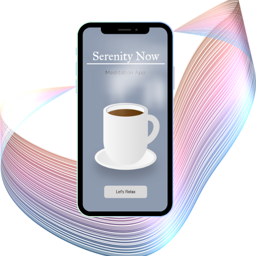

# Serenity Now - Meditation App

## Table of contents

- [Overview](#overview)
  - [The challenge](#the-challenge)
  - [Screenshot](#screenshot)
  - [Links](#links)
- [My process](#my-process)
  - [Built with](#built-with)
  - [What I learned](#what-i-learned)
  - [Continued development](#continued-development)
  - [Bonus Features](#Bonus-Features)

## 🧘🏾‍♀️ Overview

Serenity Now is a calming, mobile-first meditation app that provides a curated selection of 10-minute sessions. Each session pairs immersive background videos with soft ambient soundtracks, helping users unwind through a clean and focused interface. The app is optimized for accessibility and responsive performance across all devices.

### 🔧 The challenge

Building an app that combines HTML5 video, audio, and JavaScript timers in a seamless way — all while maintaining performance, responsiveness, and accessibility. Ensuring media loaded efficiently and that users could easily control their experience (start, pause, reset, switch durations) across multiple themed pages was key.

### 📸 Screenshot

### 🔗 Links

- Solution URL: https://github.com/Jud1th1/Meditation [https://github.com/Jud1th1/Meditation]
- Live Site URL: https://serenitynowmeditate.netlify.app/ [https://serenitynowmeditate.netlify.app/]

## 🚀 My process

1. **Conceptualization**: Inspired by JavaScript clock and timer tutorials, I reimagined the concept into a mood-focused meditation app with a tranquil, aesthetic-first approach.

2. **Design and Styling**: I created a clean and visually pleasing design, incorporating a responsive layout to ensure an optimal experience on mobile devices. This project served as an opportunity to use a pure css image I made for the intro screen.

3. **Frontend Development**: Built all pages in semantic HTML, CSS, and vanilla JavaScript. Replaced default carousels with Flexslider and integrated looping background videos + dynamic audio control.

4. **Audio Integration**: Utilized the HTML5 `<audio>` element to seamlessly integrate background music with play, pause, and reset controls.

5. **Animation & Transitions**: Added CSS page fade-ins and subtle hover/entrance animations to create a calm, floating interface that guides the user without overwhelming them.

6. **Accessibility & UX Polish**: Ensured WCAG compliance through ARIA labels, contrast adjustments, keyboard focus, and intuitive navigation. The app passed automated accessibility audits via accessiBe and Lighthouse.

### 🛠️ Built with

- HTML
- CSS (Flexbox + animations)
- Javascript (vanilla)
- jQuery Flexslider
- Mobile-first responsive design

### 💡 What I learned

- How to build a fully functioning timer from scratch using setInterval
- Audio & video syncing logic, including playback control and dynamic volume per page
- Accessibility-first development and how to pass full WCAG audits
- Designing around vibe: how layout, sound, motion, and type come together to support calm UX

### 🔮 Continued Development

While Serenity Now is fully functional and polished, I’d love to expand it with:

- 🧑‍💻 User preferences (save favorite sessions or preferred timer lengths)
- 🖥️ Desktop layout refinements for widescreen users
- 🎧 Additional meditation themes (e.g., Firelight, Rainforest, Windchimes)
- 🌙 Toggle between “Morning” and “Evening” vibes with changing color palettes

### 🌱 Bonus Features

- Pure CSS animated coffee cup welcome screen
- Looping audio with soft volume control
- Page load transitions and timer icon toggles
- Dark mode toggle with persistent preference using localStorage
